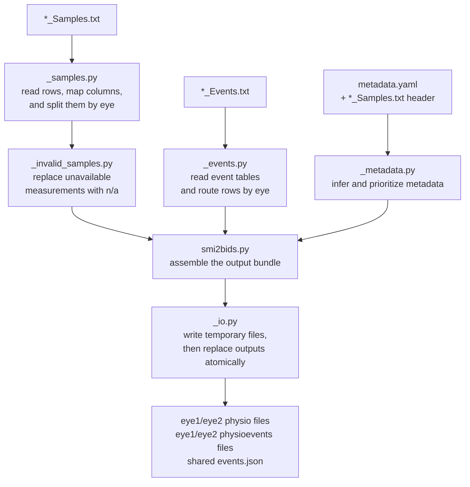

# smi2bids

`smi2bids` takes the two eye-tracking files that are obtained when exporting an SMI iView X `.idf` file using the converter found in the SMI iTools toolkit (`*_Samples.txt` and `*_Events.txt`), and converts them to the BIDS-compliant representation introduced in BIDS 1.11. (`physio.tsv.gz`/`physioevents.tsv.gz`).

It is meant as an analog to the official [eye2bids repository](https://github.com/bids-standard/eye2bids), which only supports EyeLink files (`.edf`/`.asc`).


## Installation

```console
python -m pip install -e .
```

## Python API

```python
from smi2bids import smi2bids

smi2bids(
    samples_file="recording_Samples.txt",
    events_file="recording_Events.txt",
    metadata_file="metadata.yaml",
    output_dir="sub-01/eeg",
    bids_prefix="sub-01_task-rest_run-1",
    start_time=-0.137,
)
```

Similar to `eye2bids`, the user-supplied `metadata.yaml` provides metadata information that cannot be inferred from the eye-tracking files.
See [`tests/metadata_template.yaml`](tests/metadata_template.yaml) for a template example.

Additionally, BIDS requires [`StartTime`](https://bids-specification.readthedocs.io/en/stable/glossary.html#objects.metadata.StartTime) to specify the offset to the simultaneously recorded EEG data. Since synchronization is out of scope for this module, the call to the `smi2bids` converter should not happen until this specific synchronization offset is known.


## Command line

As `eye2bids`, `smi2bids` also exposes a simple CLI command

```console
smi2bids \
  --samples-file recording_Samples.txt \
  --events-file recording_Events.txt \
  --metadata-file metadata.yaml \
  --output-dir sub-01/eeg \
  --bids-prefix sub-01_task-rest_run-1 \
  --start-time -0.137
```

## SMI file mapping to BIDS

Some of the main steps in the conversion process include:

- **File organization:** SMI can store both eyes in one `*_Samples.txt` table.
  BIDS stores every recorded eye separately, so `smi2bids` writes
  `recording-eye1` for the left eye and `recording-eye2` for the right eye. Eye-specific columns are routed to
  the corresponding file, while shared columns such as `Trial` and `Trigger`
  are copied to both.
- **Continuous samples:** SMI `Time`, `<L|R> POR X`, and `<L|R> POR Y` become
  the required first three BIDS columns: `timestamp`, `x_coordinate`, and
  `y_coordinate`. If present, `<L|R> Mapped Diameter` becomes the optional
  `pupil_size` column. The SMI device timestamp remains in microseconds
- **Unavailable measurements:** SMI represents unavailable numeric
  measurements with zero-filled groups (measurement group means all different columns relating to a specific measurement e.g. pupil diameter `pupil_diameter_<x|y|z>` or all related to gaze vector `gaze_vector_<x|y|z>`), whereas BIDS can encode them as
  `n/a`. The converter detects unavailable measurement groups,
  replaces only the affected values with `n/a`, and retains every timestamp.
  An individual zero within an otherwise available group remains a valid
  measurement.
- **Discrete events:** SMI distributes fixations, saccades, blinks, messages,
  and trigger events across several tables in `*_Events.txt`. The converter
  combines them into BIDS `physioevents` tables with the common columns
  `onset`, `duration`, `trial_type`, and `message`, converts durations from
  microseconds to seconds, and retains additional event fields. Eye-specific
  events are routed to one recording and shared messages or triggers to both.
- **Metadata:** Metadata embedded in the SMI Samples header is translated into
  BIDS fields and combined with the supplied YAML. Recording metadata and
  column descriptions are written to each `_physio.json` or
  `_physioevents.json` sidecar; task, institution, and stimulus-presentation
  metadata are written to the shared run-level `_events.json`.
- **Serialization:** The plain-text SMI tables become headerless, compressed
  `_physio.tsv.gz` and, when events are available, `_physioevents.tsv.gz`
  files. Their column names and order are stored in the corresponding JSON
  sidecars, as required by BIDS.


<!--
## Conversion policies


- **Explicit source precedence:** Non-null values in the user-supplied YAML
  take precedence over metadata inferred from the SMI header; missing YAML
  values are filled from the header where possible. Converter-owned structural
  fields such as `StartTime`, `PhysioType`, `RecordedEye`, and `Columns` are
  generated explicitly. `*_Events.txt` is the sole source of messages and eye
  events, so duplicate `MSG` rows in `*_Samples.txt` are ignored.
- **Preserve source values:** Sample rows are read as strings and written
  without numerically reformatting their original values. A separate numeric
  view is used only for validation and unavailable-measurement detection.
- **Retain useful source columns:** Known additional channels receive stable
  `snake_case` names, descriptions, and units. For example, `L Raw X [px]`
  becomes `raw_pupil_x` with `Units: pixel` in the left-eye sidecar. Unknown
  columns are retained under mechanically derived names instead of being
  discarded. Their zeros are preserved because the converter cannot safely
  interpret them as missing. SMI quality values are likewise kept because
  their coding varies between iView X versions.
- **Omit only inapplicable data:** The structural `Type` column, the opposite
  eye's measurements, and optional columns containing only missing values are
  omitted. Required columns and sample timestamps are never dropped. If an eye
  has no events, its optional `physioevents` file pair is not created.
- **Keep synchronization and dataset merging separate:** `smi2bids` does not
  align clocks, resample data, or infer metadata from existing output files.
  The output directory is only a destination; dataset-specific integration can
  subsequently merge the generated run-level metadata with existing metadata.
- **Install one reproducible output bundle:** Files are first written to a
  temporary directory using deterministic gzip metadata. The complete bundle
  then replaces any previous outputs atomically; if replacement fails partway
  through, the previous files are restored.


## Source checks and BIDS validation

Before installing the output bundle, `smi2bids` checks:

- the BIDS prefix (including required `sub-` and `task-` entities, unique entity
  keys, and the absence of a caller-supplied `recording-` entity) and that
  `StartTime` is finite;
- UTF-8 decoding and table structure for both SMI files;
- the presence of `Time` and `Type`, paired `POR X`/`POR Y` columns for every
  detected eye, at least one detected eye, and safe, unique BIDS output names;
- a numeric, positive SMI header sample rate when present, an integer declared
  sample count when present, and a finite effective `SamplingFrequency` from
  either the YAML or SMI header;
- recognized Samples row types, at least one `SMP` row, numeric values in known
  measurement columns, and present, strictly increasing timestamps;
- declared Events table headers, recognized event types, rows that do not
  exceed their matching header width, numeric onsets, and numeric, non-negative
  durations; and
- a YAML mapping and complete effective `StimulusPresentation` metadata—screen
  distance, origin, resolution, and size—from the YAML and/or SMI header.

A mismatch between the declared and parsed sample counts and sample intervals
that differ from the declared rate are reported as warnings because they do not
necessarily make otherwise readable rows unusable. Other malformed source data
causes the conversion to stop rather than being repaired. Apart from trimming
surrounding whitespace and normalizing missing or zero-filled unavailable
measurements to BIDS `n/a`, sample values are not altered.

After conversion, the official BIDS Validator should be run on the generated
dataset to check filenames, file organization, required JSON fields, and
tabular structure. This complements the SMI-specific checks above, which the
BIDS Validator cannot perform once only the converted files remain.
 -->

## Representative examples

The `tests` directory can download four real HBN input recordings and generate
their BIDS output locally, see `tests/README.md`.


## Architecture



